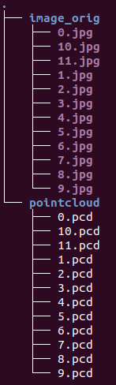

# Introduction

This workspace provides some ROS drivers and calibration tools of sensors I have tested. At present, the workspace includes the introductions of the following sensor drivers and calibration tools. 

**Sensors**

|  Type  |                            Model                             |
| :----: | :----------------------------------------------------------: |
|  IMU   |                       Xsens MTi-series                       |
| LiDAR  | Velodyne-16, RS-Ruby(128), Livox-Horizon, Ouster OS0, hesai-Pandar64 |
| Camera |               Realsense D435-series, Ladybug3                |

**Calibration tools**

| Intrinsic Calibration | Extrinsic Calibration |
| :-------------------: | :-------------------: |
|          IMU          |     LiDAR<-->IMU      |
|        Camera         |    LiDAR<-->Camera    |
|                       |     Camera<-->IMU     |
|                       |   Camera<-->Camera    |
|                       |    LiDAR<-->LiDAR     |

- [Introduction](#introduction)
- [Quick Start](#quick-start)
  - [Download & Build](#download--build)
  - [Drivers](#drivers)
    - [1. IMU](#1-imu)
    - [2. Velodyne](#2-velodyne)
    - [3. RSlidar](#3-rslidar)
    - [4. Ladybug3](#4-ladybug3)
    - [5. Livox-Horizon](#5-livox-horizon)
    - [6. Ouster](#6-ouster)
    - [7. Hesai](#7-hesai)
  - [Intrinsic Calibration](#intrinsic-calibration)
    - [1. Calibrate the camera intrinsic parameters](#1-calibrate-the-camera-intrinsic-parameters)
      - [a. Kalibr](#a-kalibr)
      - [b. ROS camera_calibration package](#b-ros-camera_calibration-package)
    - [2. Calibrate the noise and random walk noise of bias(IMU)](#2-calibrate-the-noise-and-random-walk-noise-of-biasimu)
  - [Extrinsic Calibration](#extrinsic-calibration)
    - [1. Calibrate the extrinsic parameters between LiDAR and IMU](#1-calibrate-the-extrinsic-parameters-between-lidar-and-imu)
    - [2. Calibrate the extrinsic parameters between camera and LiDAR](#2-calibrate-the-extrinsic-parameters-between-camera-and-lidar)
    - [3. Calibrate the extrinsic parameters between camera and IMU](#3-calibrate-the-extrinsic-parameters-between-camera-and-imu)
    - [4. Calibrate the extrinsic parameters between cameras](#4-calibrate-the-extrinsic-parameters-between-cameras)
    - [5. Calibrate the extrinsic parameters between LiDARs](#5-calibrate-the-extrinsic-parameters-between-lidars)
- [TO DO](#to-do)
- [Reference](#reference)
- [File tree](#file-tree)
# Quick Start

## Download & Build

```bash
sudo apt-get install libdw-dev libpcap-dev

catkin_make -DCATKIN_WHITELIST_PACKAGES="code_utils"

catkin_make -DCATKIN_WHITELIST_PACKAGES=""
```

## Drivers

### 1. IMU

The default configuration can publish `sensors_msg/IMU` message including **orientation**, **angular_velocity**, **linear_acceleration**. So you can read the IMU message by run the following code.

```bash
roslaunch read_pkg view_imu.launch
```

If there is an error called `[ERROR] [1627211303.220970]: Fatal: could not find proper MT device.` May the following code will solve the problem.

```bash
sudo chmod 777 /dev/ttyUSB0
```

> Configure the IMU:
>
> 1. Xsens IMUs have much configuration we can modify, such as `baudrate`, `Synchronization settings`, `timeout`, etc. You can have an instruction by run the following code.
>
>    ```bash
>    rosrun xsens_driver mtdevice.py -h
>    ```
>
> 2. The most common configuration is to configure which kind of messages to publish. The following configuration is to set the driver to publish **orientation**, **linear_acceleration**, **angular_velocity**, which are very important information for robotic navigation.
>
>    ```bash
>    rosrun xsens_driver mtdevice.py --configure="oq,aa,wr"
>    ```
>

### 2. Velodyne

- Configure the network:

  Edit connections --> Edit --> IPv4 Settings( Method: Manual, Addresses: Add --> Address: 192.168.1.10, Netmask: 255.255.255.0, Gateway:192.168.1.10，注：velodyne会根据当前所连接的本地IP，动态分配给自己相同网段的IP，所以只需要设置本地为静态IP即可) & modify Connection name --> save
- Get the velodyne xml file from https://github.com/Kitware/VeloView/tree/master/share and convert to a yaml file. (Optional)
- Run it

```bash
roslaunch velodyne_pointcloud VLP16_points.launch
```

### 3. RSlidar

* Modify the config file in`driver_ws/src/driver_pkg/rslidar_sdk/config/` and modify the name of config file in the`start.launch`. 

  Refer to [参数说明](./src/driver_pkg/rslidar_sdk/README_CN.md#5参数介绍) for details.

* Run it

```bash
roslaunch rslidar_sdk start.launch
```

Compress the lidar data

For RS-Ruby(128), which can reach about 70Mb/s bandwidth, some computers may lose frames during `rosbag record` . To solve this problem, we can record the compressed point cloud topic. Refer to [录制ROS数据包&离线解析ROS数据包](./src/driver_pkg/rslidar_sdk/doc/howto/how_to_record_and_offline_decode_rosbag_cn.md) for details.

Then decompress the compressed topic when using the bag file.

```bash
roslaunch rslidar_sdk decoder.launch
```

### 4. Ladybug3

Refer to https://github.com/yanliang-wang/ladybug_driver_ws.

### 5. Livox-Horizon

Refer to [README](./src/driver_pkg/livox_ros_driver/README_CN.md) for detailed configurations. Refer to [livox_ros_driver](https://github.com/Livox-SDK/livox_ros_driver) for the latest driver.

- Run it

```bash
roslaunch livox_ros_driver livox_lidar_rviz.launch
```

### 6. Ouster

Refer to [中文指南](https://ouster.atlassian.net/servicedesk/customer/portal/8/topic/a43ee57b-c27c-431c-aaa7-f2d282a6dc10/article/924090373)，[README](https://github.com/ouster-lidar/ouster_example#ouster-example-code) for details.

a. Get the IP address of your Ouster sensor after connecting to your computer.

```bash
avahi-browse -lr _roger._tcp
```

b. 驱动

```bash
# Modify the sensor_hostname in the view_ouster.launch
roslaunch read_pkg view_ouster.launch
```

c. 录制数据集

OS0(64-ring) can  reach about 33Mb/s bandwidth when recording  `/os_cloud_node/points`. So we can record the compressed topics.

```bash
rosbag record /os_node/imu_packets /os_node/lidar_packets
```

Decompress

```bash
roslaunch read_pkg view_ouster_decoder.launch 
rosbag play XXX.bag
```

> Note: There are 9 channels for one point in the ouster point cloud, which are `x, y, z, intensity, t, reflectivity, ring, ambient, range` .

### 7. Hesai

The default IP of the hesai LiDAR is `192.168.1.201`. We can read sensor data by setting local static IP to `192.168.1.XXX`.

```bash
roslaunch hesai_lidar hesai_lidar.launch lidar_type:="Pandar64" frame_id:="Pandar64" 
```

**Format converting**

Similar to RS-lidar, we can convert the format of the point in the Hesai point cloud to Velodyne's. 

```bash
rosrun hesai_to_velodyne hesai_to_velodyne XYZIRT XYZIRT
```

## Intrinsic Calibration

### 1. Calibrate the camera intrinsic parameters 

#### a. Kalibr

Refer to [kalibr](https://github.com/ethz-asl/kalibr/wiki/installation) for installation. 

Step: 

- prepare the calibration board and the config file of calibration board: [download](https://github.com/ethz-asl/kalibr/wiki/downloads) or [create custom targets](https://github.com/ethz-asl/kalibr/wiki/calibration-targets)

- record the throttled camera topic

  ```bash
  rosrun topic_tools throttle messages /camera/color/image_raw 4 /camera/color/image_raw_throttle # 4hz is enough
  
  rosbag record /camera/color/image_raw_throttle
  ```

  > when collecting the data, **the calibration board should be in the FOV of the camera and the pose for the camera should be as diverse as possible** .

- calibrate it

  ```bash
  rosrun kalibr kalibr_calibrate_cameras --bag d435-2022-06-12-11-20-10.bag --topics /camera/color/image_raw_throttle --models pinhole-radtan --target april_6x6.yaml
  ```

  > As for the distortion model of a camera, you can use `pinhole-radtan` if you are using a pin-hole camera.
  >
  > You can get more details on https://github.com/ethz-asl/kalibr/wiki/supported-models#distortion-models.

  And the calibration result will be saved in `<bag-name>-results-cam.txt`.

#### b. ROS camera_calibration package

Refer to [【Ros】摄像头标定camera calibration](https://bbs.nrs-lab.com/t/5ca16037001aec799cbea6ed).

### 2. Calibrate the noise and random walk noise of bias(IMU)

Refer to [imu_utils](https://github.com/gaowenliang/imu_utils) for installation.

Step:

- collect the data while the IMU is Stationary, with a two hours duration, **at least two hours** suggested;
- modify the param of the launch file;

```xml
<launch>
    <node pkg="imu_utils" type="imu_an" name="imu_an" output="screen">
        <param name="imu_topic" type="string" value= "/imu/data"/>
        <param name="imu_name" type="string" value= "xsens"/>
        <param name="data_save_path" type="string" value= "$(find imu_utils)/data/"/>
        <param name="max_time_min" type="int" value= "120"/> <!-- the duration of your bag (Unit: minute) -->
        <param name="max_cluster" type="int" value= "100"/>
    </node>
</launch>
```

- roslaunch the rosnode and play the bag file;

```bash
roslaunch imu_utils xsens.launch

rosbag play -r 200 XXX.bag
```

- see the result;

The calibration result is saved in `imu_utils/data`.

## Extrinsic Calibration

### 1. Calibrate the extrinsic parameters between LiDAR and IMU

Refer to [lidar_imu_calib](https://github.com/chennuo0125-HIT/lidar_imu_calib.git) for installation.

Step:

- use rosbag tool record imu and lidar data(**Note: The pose for the sensors platform should be as diverse as possible, for example, a trajectory shaped like "8".**)

  ```bash
  rosbag record /imu /lidar_points
  ```

- config launch file

  ```xml
  lidar_topic: lidar data topic name
  imu_topic: imu data topic name
  bag_file: *.bag file record imu and lidar data topic
  ```

- start

  ```
  roslaunch lidar_imu_calib calib_exR_lidar2imu.launch
  ```

### 2. Calibrate the extrinsic parameters between camera and LiDAR

Refer to [plycal](https://github.com/ram-lab/plycal).

We can get the synchronized camera and lidar data by `lidar_camera_tools`, which is needed by the plycal.

```bash
# Modify the configuration in the get_sync_data.launch
roslaunch lidar_camera_tools get_sync_data.launch
```

Push the `space` button to save the current synchronized data. The result is as follows.



### 3. Calibrate the extrinsic parameters between camera and IMU

Refer to [kalibr](https://github.com/ethz-asl/kalibr).

### 4. Calibrate the extrinsic parameters between cameras

Refer to [kalibr](https://github.com/ethz-asl/kalibr).

### 5. Calibrate the extrinsic parameters between LiDARs

Refer to [lidar_appearance_calibration](https://github.com/ram-lab/lidar_appearance_calibration) or [MLC](https://github.com/ram-lab/MLC).

# TO DO

- [ ] Detailed introduction to calibration tools between camera and LiDAR
- [ ] Detailed introduction to calibration tools between camera and IMU
- [ ] Detailed introduction to calibration tools between LiDARs
- [ ] Detailed introduction to calibration tools between cameras
- [ ] Detailed introduction to calibration tools of camera intrinsic parameter

# Reference

1. [Ubuntu在ROS下安装Velodyne驱动](https://sunjiadai.xyz/blog/2019/01/07/Ubuntu%E5%9C%A8ROS%E4%B8%8B%E5%AE%89%E8%A3%85Velodyne%E9%A9%B1%E5%8A%A8/)
2. [Velodyne driver](https://github.com/ros-drivers/velodyne.git)
3. [Xsens IMU driver](https://github.com/ethz-asl/ethzasl_xsens_driver.git)
4. [【传感器】IMU Xsens使用](https://bbs.nrs-lab.com/t/5ca06cee001aec799cbea633)
5. [rslidar driver](https://github.com/RoboSense-LiDAR/rslidar_sdk.git)
6. [lidar_imu_calib](https://github.com/chennuo0125-HIT/lidar_imu_calib.git)
7. [imu_utils](https://github.com/gaowenliang/imu_utils)
8. [livox_ros_driver](https://github.com/Livox-SDK/livox_ros_driver)
9. [ouster_example](https://github.com/ouster-lidar/ouster_example)
10. [HesaiLidar_General_ROS](https://github.com/HesaiTechnology/HesaiLidar_General_ROS)

# File tree

```
├── calib_pkg	# including the calibration tools
├── driver_pkg	# including the ROS drivers
└── read_pkg	# including config file, rviz file and launch file to read and display sensor data
```


